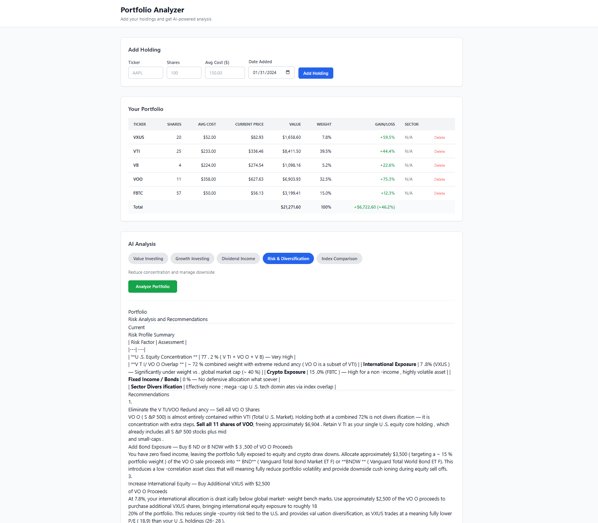

# Portfolio Analyzer

A local web application that lets you input your stock holdings and get AI-powered portfolio analysis based on different investing strategies.



## About

Portfolio Analyzer combines live market data with AI to give you actionable feedback on your stock portfolio. Add your holdings (ticker, shares, cost basis), pick an investing strategy, and get a detailed analysis powered by Claude.

**Investing strategies available:**

- **Value Investing** — Graham & Buffett style analysis focusing on P/E, P/B, intrinsic value, and margin of safety
- **Growth Investing** — Revenue growth, earnings momentum, and total addressable market
- **Dividend Income** — Yield, payout ratio, dividend sustainability, and income optimization
- **Risk & Diversification** — Sector concentration, portfolio beta, position sizing, and downside protection
- **Index Comparison** — How your portfolio stacks up against the S&P 500

## Tech Stack

| Layer      | Technology                  |
|------------|-----------------------------|
| Frontend   | React 19, Vite, TailwindCSS |
| Backend    | Python, FastAPI, SQLAlchemy  |
| Database   | SQLite                      |
| AI         | Anthropic Claude API         |
| Stock Data | yfinance                    |

## Prerequisites

- Python 3.10+
- Node.js 18+
- An [Anthropic API key](https://console.anthropic.com/)

## Getting Started

### 1. Backend

```bash
cd backend
python -m venv venv
```

Activate the virtual environment:

```bash
# Windows
venv\Scripts\activate

# macOS/Linux
source venv/bin/activate
```

Install dependencies and configure your API key:

```bash
pip install -r requirements.txt
cp .env.example .env
```

Open `.env` and add your Anthropic API key:

```
ANTHROPIC_API_KEY=sk-ant-...
ANTHROPIC_MODEL=claude-sonnet-4-5-20241022
```

Start the server:

```bash
uvicorn main:app --reload
```

The API will be running at `http://localhost:8000`. You can view the auto-generated API docs at `http://localhost:8000/docs`.

### 2. Frontend

In a separate terminal:

```bash
cd frontend
npm install
npm run dev
```

Open `http://localhost:5173` in your browser.

## Usage

1. **Add holdings** — Enter a ticker symbol (e.g. AAPL), number of shares, and your average cost basis
2. **View your portfolio** — The table shows live prices, current value, portfolio weight, and gain/loss for each holding
3. **Select a strategy** — Pick one of the five investing strategy lenses
4. **Analyze** — Click "Analyze Portfolio" and the AI will stream a detailed analysis with specific recommendations

## Project Structure

```
pyPortfolioAnalyzer/
├── backend/
│   ├── main.py              # FastAPI routes and app setup
│   ├── models.py            # SQLAlchemy database models
│   ├── schemas.py           # Pydantic request/response schemas
│   ├── database.py          # SQLite connection
│   └── services/
│       ├── ai_service.py    # Prompt building and Claude API streaming
│       ├── stock_service.py # Live stock data via yfinance
│       └── strategies.py    # Investing strategy prompt definitions
├── frontend/
│   ├── src/
│   │   ├── App.tsx          # Main application shell
│   │   ├── api/client.ts    # Backend API client and SSE streaming
│   │   ├── types.ts         # TypeScript interfaces
│   │   └── components/
│   │       ├── AddHoldingForm.tsx
│   │       ├── HoldingsTable.tsx
│   │       ├── StrategySelector.tsx
│   │       └── AnalysisResult.tsx
│   ├── package.json
│   └── vite.config.ts
└── README.md
```
